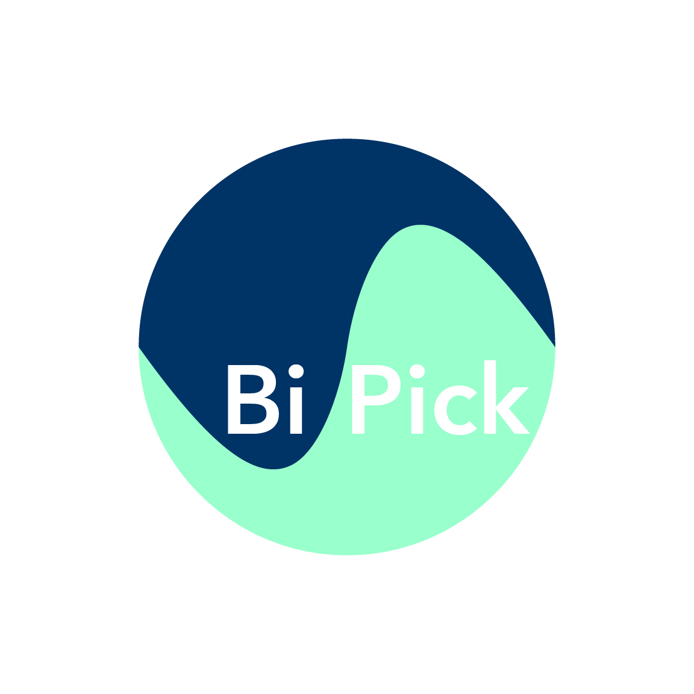
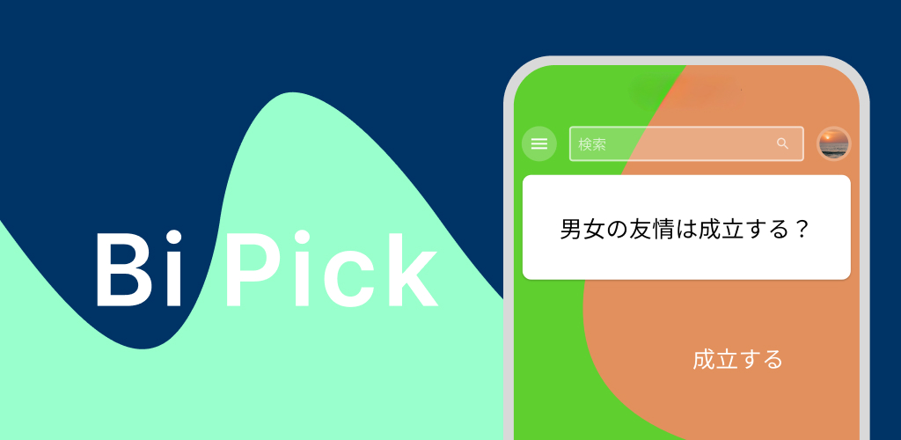
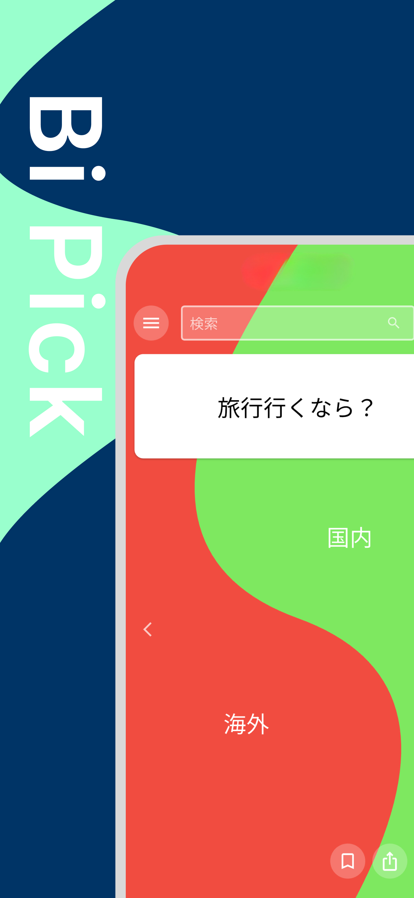
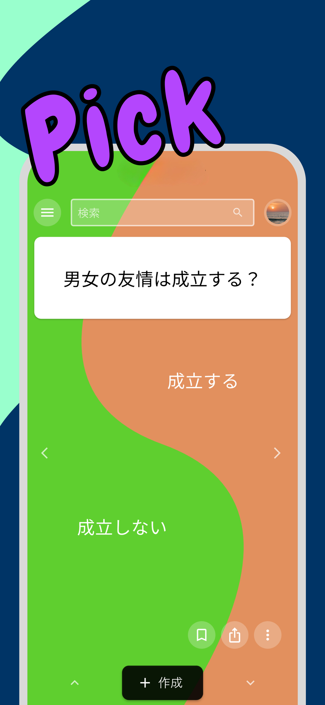
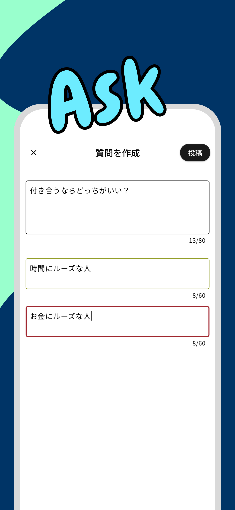
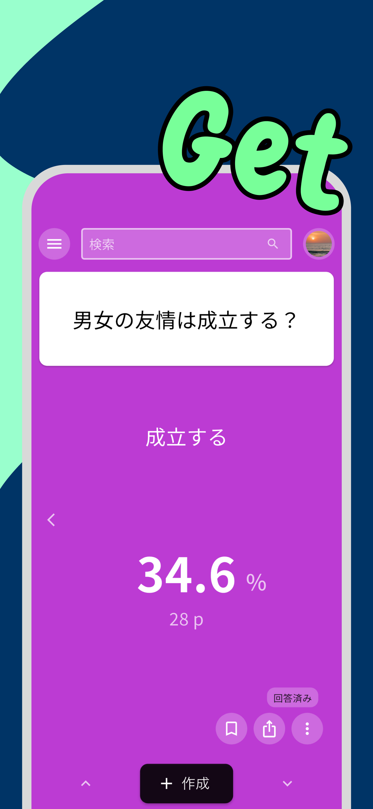

# BiPick

## 概要

**BiPick** は、"2 択" に特化した質問共有サービスです。ユーザーが 2 択の質問を投稿し、他のユーザーがどちらかを選択することで、**「自分の感覚が多数派かどうか」をリアルタイムに可視化できる** アプリケーションです。

例えば、

- **「旅行行くなら 国内 / 海外 ？」**
- **「男女の友情は 成立する / 成立しない ？」**
- **「付き合うなら 時間にルーズな人 / お金にルーズな人 ？」**

といった幅広いテーマの 2 択が集まり、気になる質問に回答することで他のユーザーの選択結果を確認できます。話題のきっかけにも、価値観の答え合わせにも最適です。

## コンセプト / 開発の意図

BiPick は、次の 2 つの問いから生まれました。

1. **Yahoo! 知恵袋のような従来型の質問共有サービスを、よりモダンな形に再定義できないか？**
   文章で問い・答える形式ではなく、「2 択から 1 つ選ぶ」だけで成立する UX に絞り込むことで、投稿・回答のハードルを極限まで下げました。

2. **「広告を見せる」広告ではなく、「広告で選んでもらう」広告が成立しないか？**
   既存の広告は "見せること" を目的としていますが、**ユーザーが選ぶこと自体を主体としたアプリ** であれば、ユーザーの選択結果そのものをデータとして活用できる、自然で違和感のない広告体験が設計できるのではないか、という仮説に基づいています。

## 主な機能

<table>
  <tr>
    <td align="center"><b>Home</b> 2 択質問の閲覧</td>
    <td align="center"><b>Pick</b> 左右スワイプで選択</td>
    <td align="center"><b>Ask</b> 質問の投稿</td>
    <td align="center"><b>Get</b> 結果の確認</td>
  </tr>
  <tr>
    <td></td>
    <td></td>
    <td></td>
    <td></td>
  </tr>
</table>

## 使用技術

| 領域           | 技術                                                                      |
| -------------- | ------------------------------------------------------------------------- |
| フロントエンド | **Flutter** (iOS / Android / Web を単一コードベースで提供)                |
| 認証           | **Firebase Authentication**                                               |
| データベース   | **Cloud Firestore**                                                       |
| ストレージ     | **Cloud Storage for Firebase**                                            |
| サーバーレス   | **Cloud Functions for Firebase** (ベクトル検索・集計などのバックエンド)   |
| ホスティング   | **Firebase Hosting** (Web 版)                                             |

## 工夫したポイント

### 1. スワイプのみで完結する UX

一般的なアプリが多用するボタン操作を極力排除し、**基本操作をすべてスワイプで完結** させました。

- **縦スワイプ** : 前後の質問へ移動 (TikTok 的な体験)
- **横スワイプ** : 2 択の選択 (左 or 右を直感的に決定)

これにより、片手でストレスなく大量の質問を高速に消費・回答できる UX を実現しています。

### 2. ベクトル検索による簡易レコメンドシステム

単純な時系列順・人気順ではなく、**ユーザーの過去の回答履歴をベクトル化し、類似度ベースでランク付けされた質問を次に表示する** 仕組みを Cloud Functions 上に実装しました。

- ユーザーごとの興味・嗜好の傾向を反映した質問が自然に上位に浮上
- 使うほど "その人向け" のフィードになっていく簡易レコメンド体験を提供

## インストール方法

### モバイルアプリ

- **iOS 版** : [App Store](https://apps.apple.com/jp/app/bipick/id6737619772)
- **Android 版** : [Google Play](https://play.google.com/store/apps/details?id=com.which464.which)
